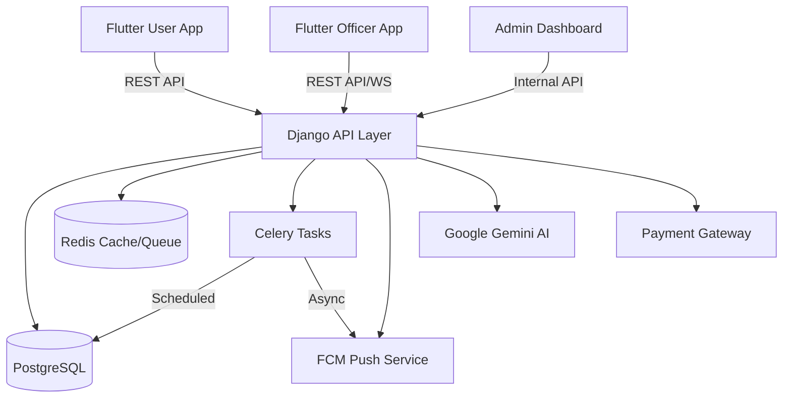

# 🏙️ JAMBO PARK: Enterprise Intelligent Parking System

> A state-of-the-art, multi-tenant parking management ecosystem designed for municipal authorities, private operators, and vehicle owners. Built for scalability, security, and real-time operations.

---

## 🏗️ System Architecture

The JAMBO PARK ecosystem consists of a high-performance Django backend serving two native Flutter mobile applications and a web-based administrative dashboard.



---

## 🚀 Core Components

### 1. Backend Engine (Django REST Framework)
- **Framework**: Django 4.2+ with Channels (WebSockets).
- **Architecture**: Modular Monolith with 10+ internal apps.
- **Key Modules**:
  - `accounts`: Advanced user profiles, vehicle management, and single-device login enforcement.
  - `parking`: Real-time session tracking, zone availability, and reservation engine.
  - `enforcement`: Officer management, violation issuance with evidence capture, and GPS tracking.
  - `payments`: Multi-provider gateway (Pesapal), transaction auditing, and digital wallet system.
  - `notifications`: Multi-channel notification engine (FCM, SMS, In-app).
  - `support_chat`: AI-powered customer support integrated with Google Gemini.

### 2. Mobile Ecosystem (Flutter)
- **Parking User App**: Features zone exploration via `flutter_map`, real-time session timers, digital payments, and violation management.
- **Parking Officer App**: Optimized for field operations, featuring QR code scanning, violation reporting with camera integration, and real-time zone monitoring.
- **State Management**: Scalable `Provider` architecture with Clean Architecture patterns.

---

## 🔒 Enterprise Security & Compliance

The system is designed with a "security-first" mindset, adhering to industry standards for data protection and financial integrity.

### Data Protection
- **JWT Authentication**: Secure token-based auth with device-specific session IDs (`JTI`).
- **Encryption**: HTTPS/TLS 1.2+ mandatory for all API communication.
- **HSTS & Security Headers**: Full implementation of HSTS, X-Content-Type-Options, and X-XSS-Protection.
- **Single Device Policy**: Middleware restriction ensuring user accounts can only be active on one mobile device at a time.

### Financial Integrity
- **Immutable Auditing**: Every transaction is logged with a non-modifiable audit trail.
- **Compliance**: Adherent to municipal reporting requirements with accurate revenue attribution.
- **Evidence Management**: Violation records include cryptographically linked GPS coordinates and photographic proof.

---

## 🛠️ Deployment & Development

### ⚡ One-Click Cloud Deployment (Render)
[](https://render.com/deploy?repo=YOUR_REPO_URL)
1. Ensure your repository has a `render.yaml` (already included).
2. Click the button above to provision the DB, Redis, and all services instantly.

### 🐳 Docker Quick Start
Spin up the entire ecosystem (API, DB, Redis, Workers) with a single command:
```bash
docker-compose up --build
```

### ⌨️ Makefile Shortcuts
| Command | Result |
|---------|--------|
| `make install` | Install all dependencies |
| `make run` | Start local Django server |
| `make migrate` | Synchronize database schema |
| `make worker` / `make beat` | Start background task engines |
| `make build-apk` | Compile User App for distribution |

### Manual Execution (Production - Render/Cloud)
1. **Environment Configuration**: Configure `.env` with `DJANGO_SETTINGS_MODULE=config.settings.production`.
2. **Infrastructure**:
   - **DB**: PostgreSQL (Managed).
   - **Cache**: Redis 6.0+.
   - **Broker**: Redis for Celery tasks.
3. **Execution**:
   ```bash
   # Collect static assets
   python manage.py collectstatic --noinput
   # Run migrations
   python manage.py migrate
   # Start Gunicorn/Daphne
   gunicorn config.wsgi:application --bind 0.0.0.0:$PORT
   ```

### Mobile Apps (Flutter)
1. **Prerequisites**: Flutter SDK 3.10.7+, Java 17+, Xcode 14+.
2. **Android Build**:
   ```bash
   cd parking_user_app
   flutter pub get
   flutter build apk --release --split-per-abi
   ```
3. **iOS Build**:
   ```bash
   cd parking_user_app/ios
   pod install
   cd ..
   flutter build ios --release --no-codesign
   ```

---

## 📡 API Reference Documentation

### Authentication Flow (V2)
| Method | Endpoint | Description |
|--------|----------|-------------|
| `POST` | `/api/user/auth/register/` | Register new vehicle owner |
| `POST` | `/api/user/auth/login/` | Phone-based login with JTI emission |
| `POST` | `/api/user/auth/verify-otp/` | MFA verification step |

### Parking Operations
| Method | Endpoint | Description |
|--------|----------|-------------|
| `GET`  | `/api/user/zones/` | List zones with real-time slot occupancy |
| `POST` | `/api/user/parking/start/` | Begin active session (supports geolocation validation) |
| `POST` | `/api/user/parking/extend/` | Extend session duration with automated pricing |

### Enforcement (Officer API)
| Method | Endpoint | Description |
|--------|----------|-------------|
| `POST` | `/api/officer/violations/issue/` | File violation with image evidence |
| `GET`  | `/api/officer/validate/qr/` | Verify active session via QR scan |

---

## 🔄 Autonomous Maintenance (Celery Beat)

The system maintains itself through a series of scheduled autonomous tasks:
- **`check-expired-sessions`**: Runs every 1 minute to auto-notify users.
- **`generate-daily-revenue`**: Automated accounting at 00:05 AM.
- **`check-system-health`**: Hourly diagnostics and error reporting.
- **`cleanup-system-data`**: Weekly purging of redundant logs (Sundays at 3:00 AM).

---

## 📊 References & Further Reading

- [System Architecture Document](./docs/architecture.md)
- [Database Schema & Spec](./docs/database_schema.md)
- [Mobile Design System](./docs/design_system.md)
- [Docker & Secrets Management Guide](./docs/deployment_and_secrets.md)

---
*© 2026 JAMBO PARK Solutions. Confidential and Proprietary.*