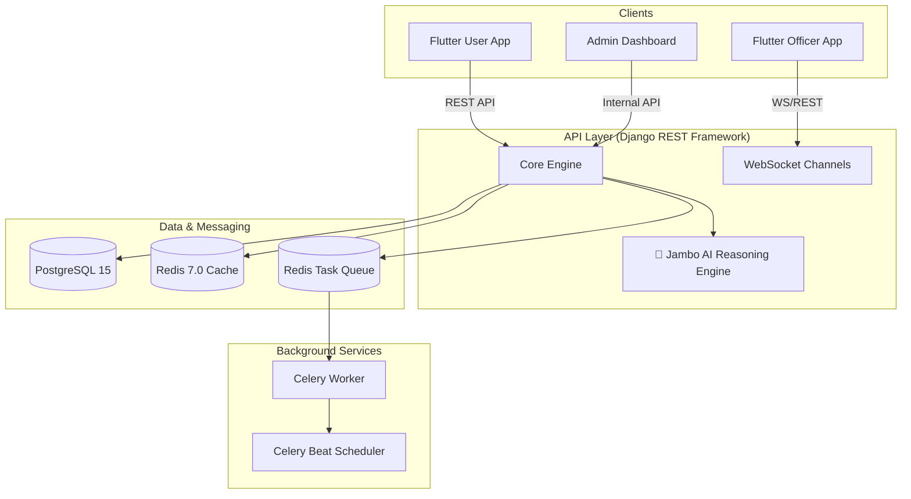
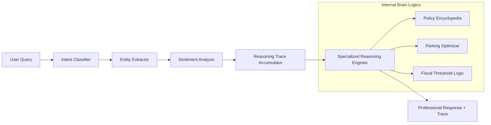
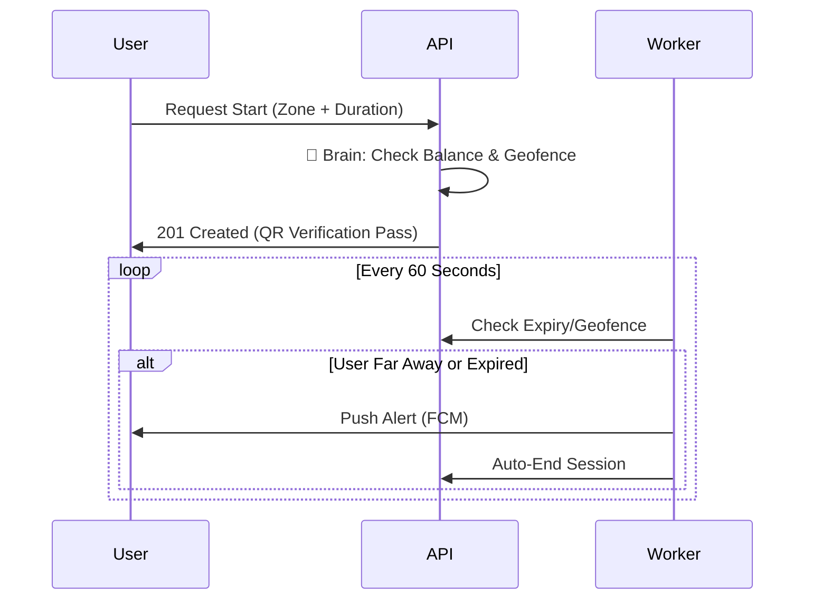

# 🏙️ JAMBO PARK: Enterprise Intelligent Parking System

[](https://jambo-park.render.com)
[](LICENSE)
[](https://github.com/your-repo/jambo-park/graphs/commit-activity)

> **JAMBO PARK** is a state-of-the-art, multi-tenant parking management ecosystem designed for municipal authorities, private operators, and vehicle owners. Built for massive scalability, financial integrity, and real-time operations without external AI latency.

---

## 🏛️ Ecosystem Architecture

The system follows a modular monolith architecture with a decoupled frontend ecosystem.



---

## 🧠 The Jambo AI "Brain" (Local Reasoning)

One of JAMBO PARK's most advanced features is the **Jambo AI Pro**—a sophisticated reasoning engine that operates entirely locally, providing "Brain-like" intelligence without external API costs or data privacy concerns.

### Reasoning Pipeline


---

## 🏗️ Repository Blueprint

A guided map through the JAMBO PARK codebase:

```text
JAMBO PARK/
├── apps/                       # Backend Application Modules
│   ├── accounts/               # Identity, Auth, & Vehicle Management
│   ├── parking/                # core logic: Zones, Sessions, Slots
│   ├── enforcement/            # Officer logs, Violations, QR Scanning
│   ├── rewards/                # Loyalty tiers & Point transactions
│   ├── payments/               # Fiscal ledger & Gateway integrations
│   ├── support_chat/           # 🧠 Jambo AI Home & Reasoning Core
│   └── common/                 # Reusable BaseModels & Mixins
├── config/                     # Django Project Settings & Routing
├── parking_user_app/           # Flutter: Primary Consumer Application
├── parking_officer_app/        # Flutter: Operational Enforcement Tool
├── docs/                       # Comprehensive Technical Specs
├── templates/                  # Django Responsive Admin Templates
└── scripts/                    # Deployment & Maintenance Utilities
```

---

## 🛡️ Enterprise-Grade Security & Infrastructure

### 1. Single-Device Enforcement (SDE)
To prevent account sharing and ensure high-integrity enforcement, the system employs a custom `SingleDeviceLoginMiddleware`.
- **Mechanism**: Every JWT contains a standard `jti` (JWT ID). The database maintains the `current_session_jti`.
- **Enforcement**: If a request comes in with a non-matching `jti`, the session is instantly invalidated across all channels.

### 2. Regional Multi-Tenancy
The system natively supports cross-border operations using a **Regional Routing Context**.
- **Model Isolation**: Models inheriting from `RegionalModel` are automatically partitioned by `country_id`.
- **Automatic Filtering**: `RegionalContextMiddleware` ensures that a user in Kenya never sees parking data from Uganda, enforced at the query level.

---

## 📡 Core System Flows

### Parking Session Lifecycle


---

## 🛠️ Development & Deployment

### ⚡ Quick Start
```bash
# Clone and install dependencies
git clone https://github.com/jambo-park/system.git
make install

# Spin up local development environment
docker-compose up -d

# Initialize database
make migrate
make seed-data
```

### ⌨️ Management Interface
| Command | Action |
|---------|--------|
| `make run` | Starts Django + Celery + Redis |
| `make test` | Executes full suite (Backend + Flutter) |
| `make worker` | Dedicated Celery background worker |
| `make build-apk` | Generates release-ready Flutter distribution |

---


*© 2026 JAMBO PARK Solutions. Confidential and Proprietary. Enterprise Edition v2.4.*