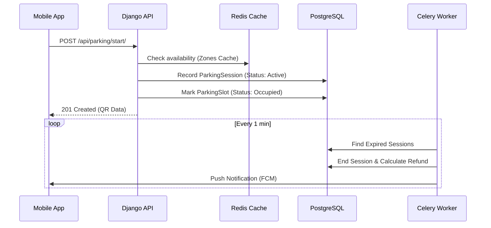

# 🏗️ JAMBO PARK Architecture & System Design

This document provides an exhaustive technical breakdown of the JAMBO PARK infrastructure, architectural patterns, and internal data flows.

---

## 🟢 1. Technical Stack & Infrastructure

The system follows a decoupled architecture using high-performance, industry-standard technologies.

| Layer | Component | Implementation |
|-------|-----------|----------------|
| **Core** | Django 4.2+ | Primary application framework following the MTV pattern. |
| **API** | Django REST Framework | Stateless RESTful interface with versioned endpoints. |
| **Real-time** | Django Channels 4.0 | ASGI-based WebSocket handling for live officer telemetry. |
| **Database** | PostgreSQL 15 | Relational data store with geospatial indexing. |
| **Cache** | Redis 7.0 | Distributed cache for sessions, throttling, and task results. |
| **Tasks** | Celery 5.3+ | Distributed task queue for asynchronous and scheduled jobs. |
| **Monitoring** | Sentry / Logging | Unified logging via shared console and file handlers. |

---

## 🔒 2. Security & Identity Architecture

### 2.1 authentication Lifecycle
Authentication utilizes `rest_framework_simplejwt` with custom enhancements for enterprise-grade session control.

- **Non-Expiring Mobile Tokens**: For mobile apps, `ACCESS_TOKEN_LIFETIME` is set to 365 days to minimize friction.
- **JTI Session Tracking**: Every token contains a unique `jti` (JWT ID). This ID is synchronized in the `User` model.
- **Single-Device Enforcement**:
  - `SingleDeviceLoginMiddleware` intercepts every API request.
  - It compares the token's `jti` against `user.current_session_token`.
  - If a mismatch is detected (due to a login on a new device), the middleware returns a `401 Unauthorized` with an `X-Session-Invalidated` header.

### 2.2 Data Isolation (Regional Multi-Tenancy)
- **RegionalContextMiddleware**: Identifies the user's `Country` context during the request lifecycle.
- **Thread-safe Isolation**: Uses `asgiref.local` (via `set_current_country`) to ensure queries are automatically filtered by `country_id` at the database level without manual developer intervention.

---

## 📡 3. Background Processing & Geofencing

The system performs significant "off-main-thread" heavy lifting via Celery Beat.

### 3.1 Geofencing Algorithm (Haversine)
The system uses the Haversine formula to calculate the "Great Circle Distance" between users and zones:
```python
def calculate_distance(lat1, lon1, lat2, lon2):
    lon1, lat1, lon2, lat2 = map(math.radians, [lon1, lat1, lon2, lat2])
    dlon = lon2 - lon1 
    dlat = lat2 - lat1 
    a = math.sin(dlat/2)**2 + math.cos(lat1) * math.cos(lat2) * math.sin(dlon/2)**2
    c = 2 * math.asin(math.sqrt(a)) 
    r = 6371 # Earth radius in km
    return c * r
```

### 3.2 Automated Task Schedule
| Task | Frequency | Purpose |
|------|-----------|---------|
| `check_expired_sessions` | 1 min | Auto-ends sessions, releases `ParkingSlot`, and triggers FCM notifications. |
| `validate_active_session_location` | 10 min | Geofencing check: Notifies users >1km away from their zone. |
| `notify_exit_overdue` | 5 min | Checks if users who ended their session are still within 200m (radius) of the zone. |
| `cleanup_system_data` | Weekly | Purges redundant audit logs and temporary session data. |

---

## 🔄 4. Message Flow Sequence



---
*© 2026 JAMBO PARK Solutions. Confidential and Proprietary.*
