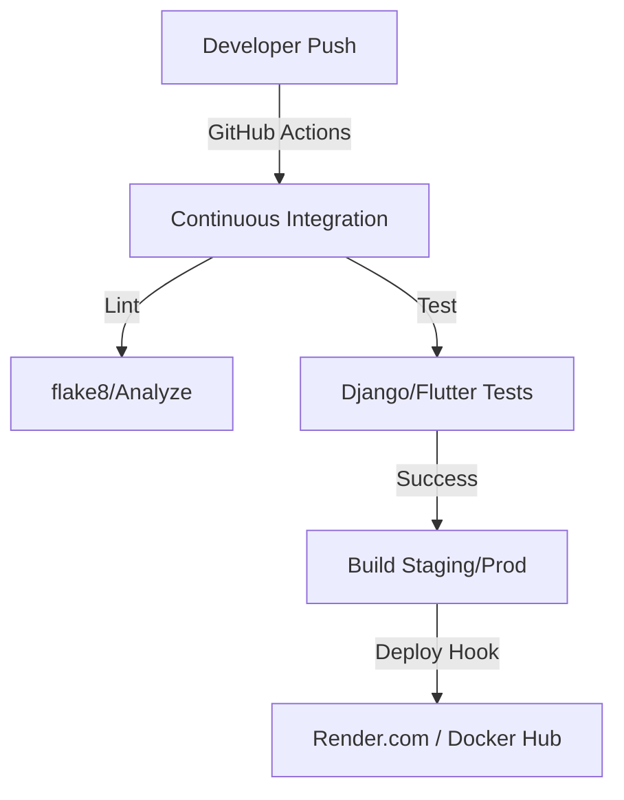

# 🏗️ JAMBO PARK: Architecture & Engineering Spec

This document provides a deep-dive into the technical foundations of the JAMBO PARK ecosystem.

---

## 🟢 1. Technical Stack & Infrastructure

The system follows a decoupled architecture using high-performance, industry-standard technologies.

| Layer | Component | Implementation |
|-------|-----------|----------------|
| **Core** | Django 4.2+ | Primary application framework with modular apps. |
| **API** | Django REST Framework | Stateless RESTful interface with JWT authentication. |
| **Real-time** | Django Channels 4.0 | ASGI-based WebSockets for live officer telemetry. |
| **Database** | PostgreSQL 15 | Relational data store with geospatial indexing. |
| **Cache** | Redis 7.0 | Used for sessions, throttling, and task results. |
| **Tasks** | Celery 5.3+ | Distributed task queue for geofencing and expiry checks. |
| **CI/CD** | GitHub Actions | Automated testing and linting for Backend and Flutter. |

---

## 🔒 2. Security & Identity Architecture

### 2.1 authentication Lifecycle
- **JTI Session Tracking**: Every JWT contains a unique `jti`. This is synchronized in the database to enable **Single-Device Enforcement (SDE)**.
- **Middleware Guard**: `SingleDeviceLoginMiddleware` intercepts every request to verify the token is from the most recent login.

### 2.2 Data Isolation (Regional Multi-Tenancy)
The system natively supports cross-border operations using **Regional Routing Context**.
- **RegionalContextMiddleware**: Identifies the user's country context.
- **Thread-safe Isolation**: Uses `asgiref.local` to ensure all queries are automatically filtered by `country_id` without manual code changes.

---

## 📡 3. Background Processing & Geofencing

The system performs critical "off-main-thread" heavy lifting via Celery.

### 3.1 Geofencing Algorithm (Haversine)
Used to calculate the distance between vehicle's GPS and the parking zone center.
- **Thresholds**: 
    - **Proximity**: 200m radius for session active check.
    - **Drift warning**: >1km movement triggers a "Don't Forget" alert.

### 3.2 Automated Task Schedule
| Task | Frequency | Purpose |
|------|-----------|---------|
| `check_expired_sessions` | 1 min | Auto-ends sessions and releases slots. |
| `validate_location` | 10 min | Geofencing validation for active sessions. |
| `notify_exit_overdue` | 5 min | Alerts officers to users still in zone post-session. |

---

## 🧠 4. Jambo AI Pro: Local Reasoning Engine

Operating entirely within the Python/Django stack (no external API), the AI engine uses a multi-stage reasoning pipeline:

1.  **Intent Detection**: Classifies user queries (Financial, Support, Policy).
2.  **Context Loading**: Pulls relevant system data (User status, Policy entries).
3.  **Reasoning Trace**: Accumulates a logic trail to justify responses.
4.  **Professional Synthesis**: Generates a zero-latency response with suggested next actions.

---

## 🔄 5. CI/CD & Automation Flow

---
*© 2026 JAMBO PARK Solutions. Confidential and Proprietary. v2.6*
