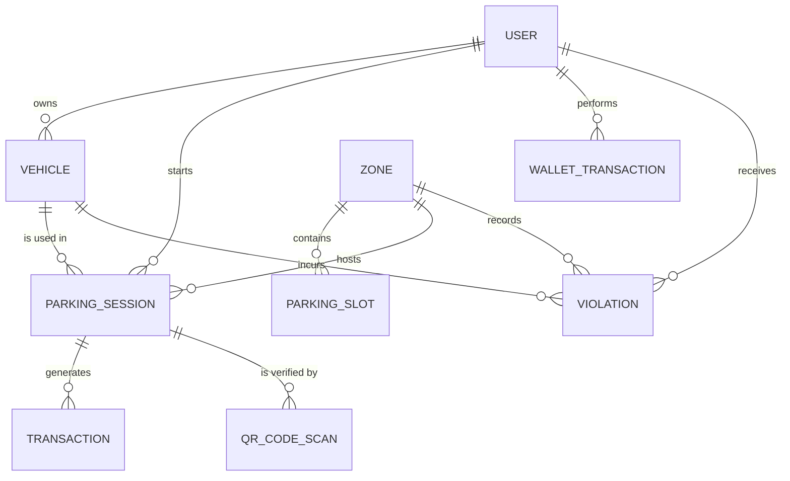

# 📊 Database Schema Spec & ERD

JAMBO PARK utilizes a PostgreSQL database with a normalized structure, optimized for geospatial queries and high-integrity financial auditing.

---

## �️ Entity Relationship Diagram

---

## 📋 Table Specifications

### 1. `accounts_user`
Standard user table with custom extensions for session/device tracking.
- `id`: UUID (Primary Key)
- `phone`: PhoneNumberField (Unique Index)
- `wallet_balance`: Decimal(12, 2)
- `current_session_token`: CharField(500) - Stores the JTI for single-device enforcement.
- `fcm_device_token`: CharField(255) - Cached for push notification delivery.

### 2. `parking_zone`
Geographic container for parking rules and capacity.
- `hourly_rate`: Decimal(12, 2)
- `latitude` / `longitude`: Decimal(9, 6)
- `radius_meters`: Integer (Default: 100m) - Used for geofencing validation.
- `total_slots`: Integer - Hard capacity limit for enforcement.

### 3. `parking_session`
The core transactional record linking all entities.
- `status`: Enum (`active`, `completed`, `expired`, `cancelled`, `pending_payment`)
- `start_time` / `planned_end_time`: DateTime (Indexed)
- `estimated_cost` / `final_cost`: Decimal(12, 2)
- `idempotency_key`: UUID - Prevents duplicate session creation on retry.

---

## 🏗️ Model Inheritance Architecture

### `BaseModel`
Every table inherits from `BaseModel`, providing:
- `id`: UUID (Auto-generated)
- `created_at`: DateTime (Auto-now)
- `updated_at`: DateTime (Auto-now)

### `RegionalModel`
Tables requiring multi-country isolation (Zones, Payment Configs) inherit from this:
- `country`: ForeignKey to `Country` (Cascade)
- **Automatic Filtering**: Coupled with `RegionalContextMiddleware`, queries are automatically scoped by the user's country.

---

## 📈 Optimization & Integrity

### Indexes
- **Geospatial**: Compound GIST index on `(latitude, longitude)` for violations.
- **Audit**: Descending B-Tree index on `created_at` for high-speed ledger access.
- **Enforcement**: Unique constraint on `(vehicle, status='active')` to prevent concurrent sessions for the same vehicle.

### Hard-Deletion Policy
Data is never hard-deleted. The system uses soft-deletion fields (`is_active` or `deletion_planned_at`) to maintain financial and legal integrity for municipality audits.

---
*© 2026 JAMBO PARK Solutions. Confidential and Proprietary.*
