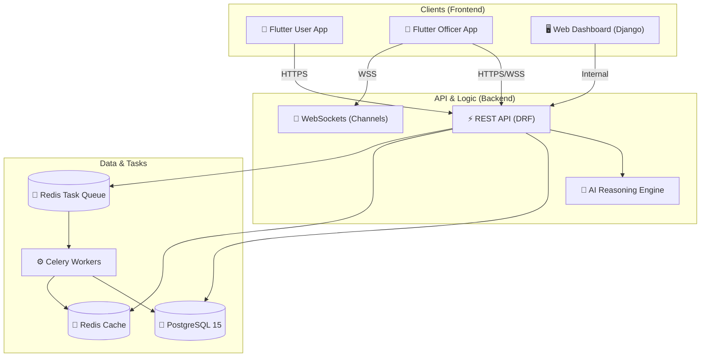
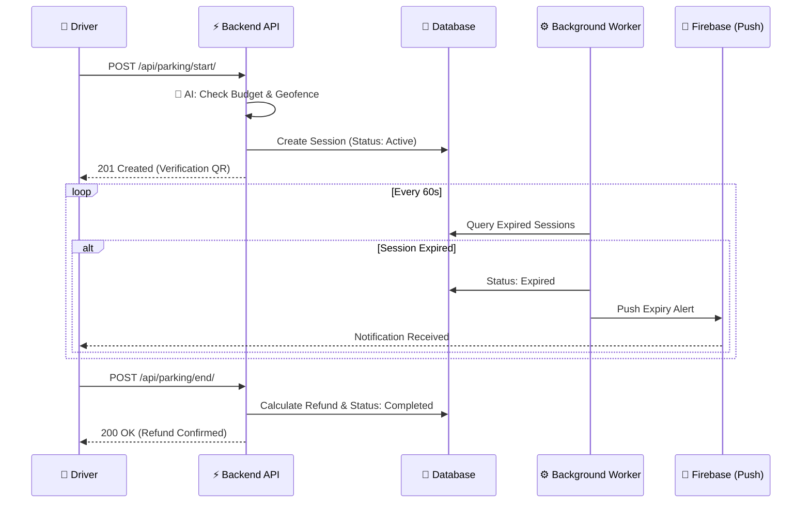
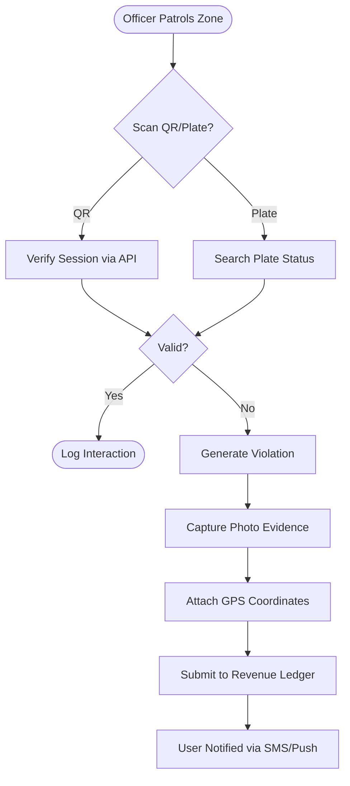
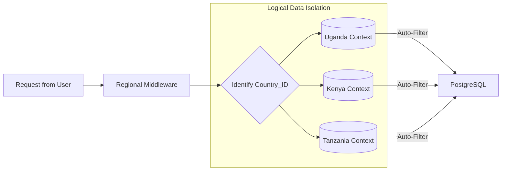
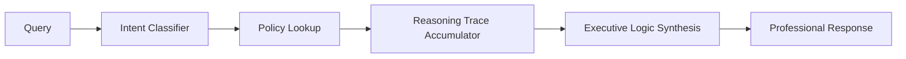

# 📊 JAMBO PARK: System Structures & Visual Flows

This document centralizes the visual representations of the JAMBO PARK ecosystem, from high-level infrastructure to granular operational sequences.

---

## 🏗️ 1. High-Level System Architecture
This diagram shows how the mobile clients, web dashboard, and backend services interact through the API and Messaging layers.

---

## 🔄 2. Parking Session Lifecycle
The sequence of events from a user starting a session to the automated cleanup and notification.

---

## 👮 3. Enforcement & Verification Flow
How officers verify vehicle status and issue violations.

---

## 🌐 4. Regional Multi-Tenancy Isolation
How the system partitions data across different countries (Metadata-based isolation).

---

## 🧠 5. Jambo AI Reasoning Pipeline
The internal "Think" process for local intelligence.

---
*© 2026 JAMBO PARK Solutions. Confidential and Proprietary. v1.0*
